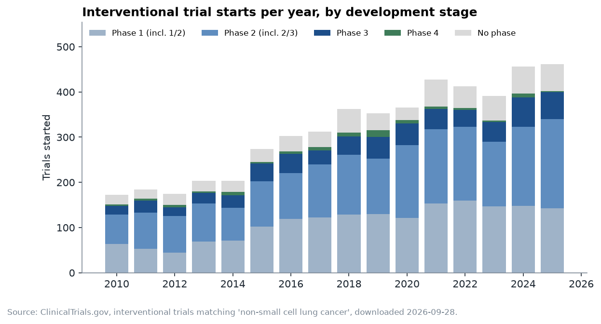
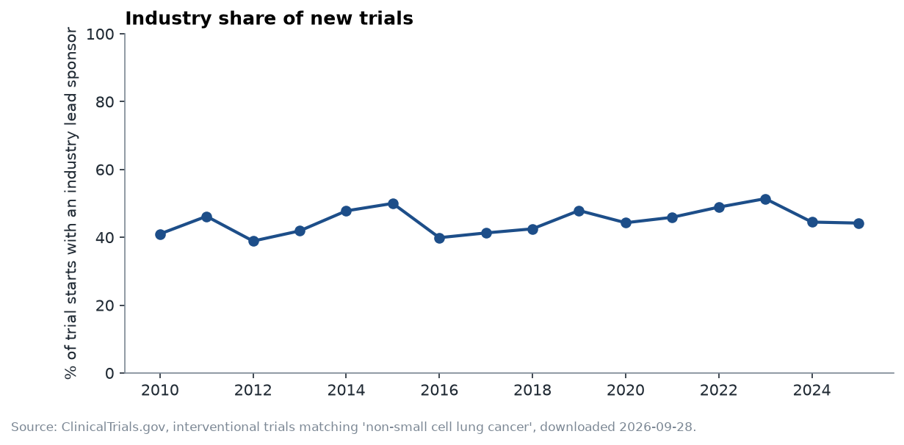
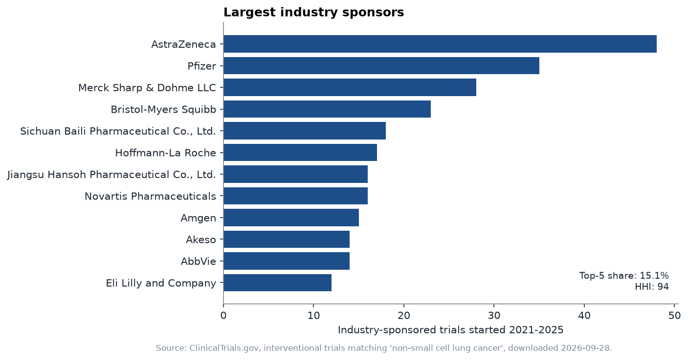
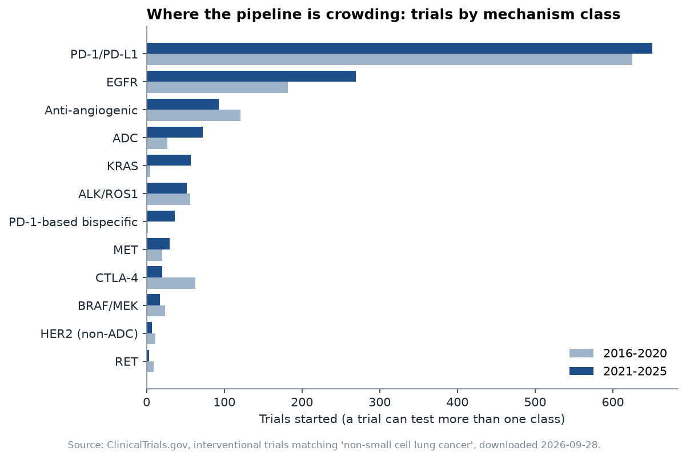
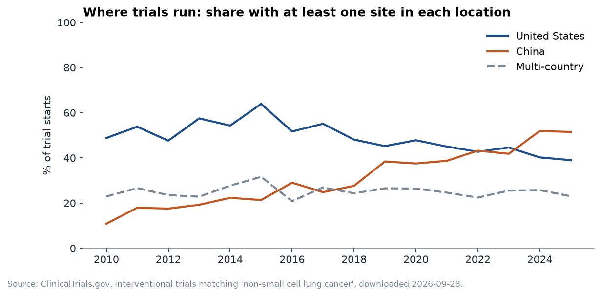
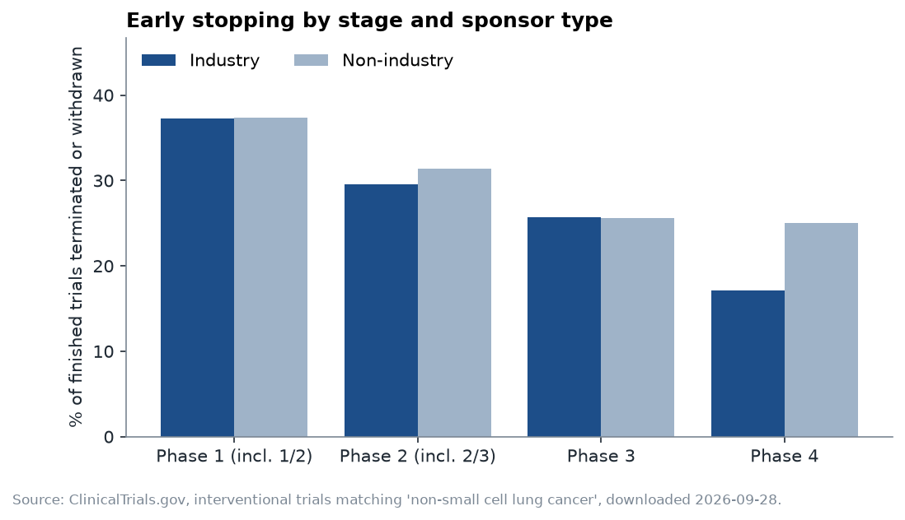
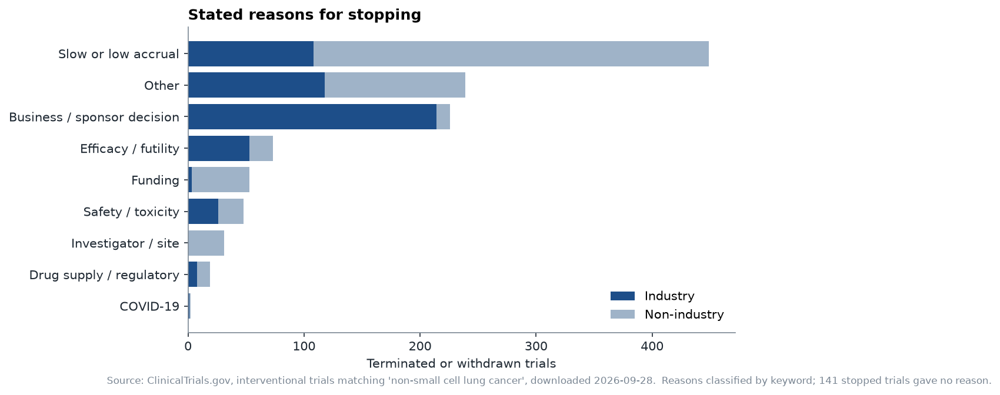
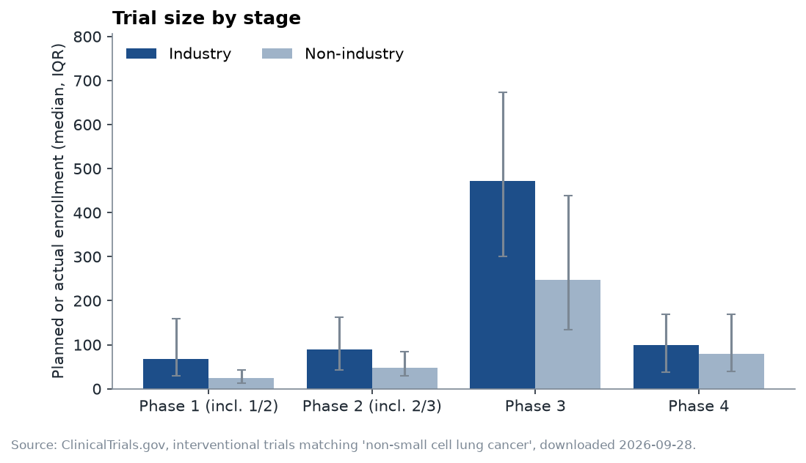
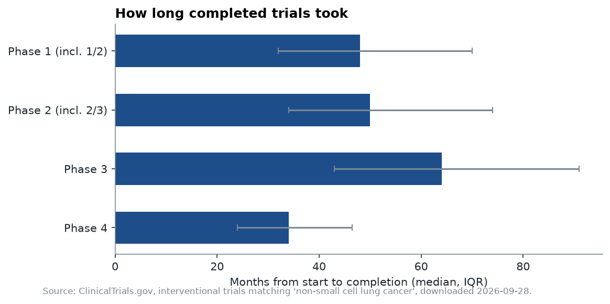

# NSCLC Clinical Trial Landscape

What does the clinical development pipeline for non-small cell lung cancer look like, who is running it, and where is it getting crowded?

This project pulls all 7,194 interventional trials returned by the [ClinicalTrials.gov](https://clinicaltrials.gov) condition search for NSCLC (downloaded 28 September 2026) through the public v2 API and turns it into the kind of landscape view a biotech strategy or business development team would use before entering a space or evaluating a partner.

## Questions

1. **Pipeline shape.** How has the mix of Phase 1, 2 and 3 trial starts changed since 2010?
2. **Who runs the field.** What share of new trials is industry-led, and how concentrated is industry activity (top-5 share, HHI)?
3. **Where the crowding is.** Which mechanism classes (PD-1/PD-L1, ADCs, EGFR, KRAS, PD-1-based bispecifics and others) gained or lost trial activity between the last two five-year periods?
4. **Where trials run.** How have the shares of trials with US sites, with Chinese sites, and multi-country trials moved over time?
5. **Execution risk.** How often do trials stop early, at which stage, and for what stated reasons?

## Findings

- **Growth, led by Phase 2.** Trial starts rose from 173 (2010) to 462 (2025); Phase 2 starts tripled.
- **PD-1/PD-L1 has plateaued.** It grew 4% between 2016-20 and 2021-25, while ADCs (27 to 72), KRAS inhibitors (5 to 57) and PD-1-based bispecifics (2 to 36) grew fastest. CTLA-4 fell 68%.
- **China overtook the US.** The share of new trials with a site in China rose from 11% to 52% and passed the US share (now 39%) in 2022.
- **A fragmenting field.** Industry sponsors rose from 290 to 409, and the top five's share fell from 21% to 15% (HHI 144 to 94).
- **Trials mostly stop for non-scientific reasons.** 32% of finished trials were terminated or withdrawn. Where a reason was given, 68% were operational or business reasons and about 11% efficacy or safety, matching Williams et al. (2015).

Full write-up: [`reports/memo.md`](reports/memo.md).

## Figures

| | |
|---|---|
|  |  |
|  |  |
|  |  |
|  |  |
|  | |

## Run it

Requires Python 3.10+. On macOS, use `python3` and `pip3` in place of `python` and `pip`.

```bash
pip install -r requirements.txt
python -m ctlandscape check     # live test: fetches 3 records and prints how they parse
python -m ctlandscape run       # full download (a few minutes), figures and report
python -m pytest                # tests, no network needed
```

The first `run` caches the raw download in `data/`. Later runs reuse the cache; add `--refresh` to download again. To look at a different indication, change `CONDITION` in `ctlandscape/settings.py`. The mechanism dictionary is NSCLC-specific and would need replacing.

## How it works

| Step | File | Notes |
|---|---|---|
| Download | `fetch.py` | Cursor pagination (`nextPageToken`), retries on 429/5xx, only the fields needed. If the API rejects the server-side interventional filter or the field list, it falls back to a simpler request and filters locally. The request mode used is recorded in the report. |
| Parse | `parse.py` | One row per trial. Handles month-only dates, combined phases, missing modules and duplicate records. Stops the run if a key field comes back empty for every trial. |
| Classify | `mechanisms.py` | Maps free-text drug names, including development codes such as MK-3475 and AMG 510, to mechanism classes. |
| Analyse | `analyze.py` | Metrics, plus sanity checks against published ranges. |
| Output | `figures.py`, `report.py` | Nine charts and `reports/numbers.md`, which holds every number behind them. |

## Method choices

- **Scope:** interventional studies returned by the registry's condition search for "non-small cell lung cancer". The search expands synonyms, so a few loosely related trials are included.
- **Time comparisons** use trial start year and full calendar years only: the last five full years against the five before them.
- **Stop rate** = (terminated + withdrawn) / (completed + terminated + withdrawn). Ongoing and unknown-status trials are excluded from the denominator.
- **Duration** uses completed trials, excluding any whose completion date is marked estimated. Older records carry no date type and are kept.
- **Sponsor concentration** uses lead-sponsor names, with known subsidiaries merged into their current parent (`SPONSOR_ALIASES` in `parse.py`). HHI is the sum of squared percentage shares (0 to 10,000).

## Limitations

- **Stop rates are not success rates.** A trial that completes can still fail its endpoint. Probability-of-success figures, such as the roughly 8% overall likelihood of approval from Phase 1 in the BIO/Informa/QLS 2011-2020 study, come from program-level databases and can't be reproduced from registry records.
- **Trials are not drugs.** One drug can appear in dozens of trials, so trial counts measure activity, not the number of programs.
- **Registry coverage is uneven.** Many trials in China are registered only on ChiCTR, so the China share shown here is a lower bound.
- **Self-reported data.** Sponsors enter and update their own records. Statuses go stale, which is why many old trials show as UNKNOWN.
- **Keyword classification.** Drug-to-mechanism mapping and stop-reason categories are rule-based. They are covered by tests but not validated against a curated source. Drugs outside the dictionary stay unclassified.
- **Sponsor consolidation is partial.** Known subsidiaries are merged into their current parent (e.g., Genentech into Roche, Seagen into Pfizer); smaller name variants may remain.

- **Duration includes follow-up.** The registry's completion date is the last data collection for any outcome, often including long survival follow-up, so durations here run longer than published phase-duration benchmarks and should not be compared with them directly.
- **Registration lag.** Some trials that started in the most recent year are not registered yet, so the latest year's count is a minimum.

## References

- ClinicalTrials.gov API documentation: https://clinicaltrials.gov/data-api/api
- BIO, Informa Pharma Intelligence, QLS Advisors. *Clinical Development Success Rates and Contributing Factors 2011-2020* (2021).
- Wong CH, Siah KW, Lo AW. Estimation of clinical trial success rates and related parameters. *Biostatistics* 20(2):273-286 (2019).
- Williams RJ, Tse T, DiPiazza K, Zarin DA. Terminated trials in the ClinicalTrials.gov results database. *PLoS One* 10(5):e0127242 (2015).

Data: ClinicalTrials.gov, U.S. National Library of Medicine.

Author: Dhruvi Mewada
